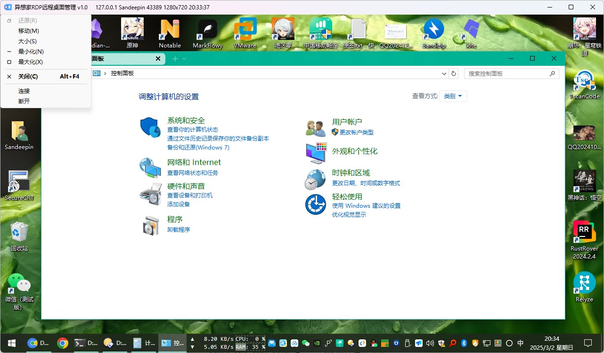

# JfzRDP
基于C#开发的RDP远程桌面管理小工具

### 截图

### 说明

基于MSTSCLib.dll开发的微软RDP远程桌面小工具，主要是方便自己用，突出的就是简单，也是第一次尝试借助AI辅助编程，使用不熟悉的C#语言也能做个小玩具，体验真不错，哈哈^_^

主要是为了解决自己的痛点，很多设置项屏蔽了，后面有精力逐步增加配置项。

密码也明文保存，推荐大家自用，**不要分享server.json文件！！！**

主要个人喜好：

* 从标题栏点击右键菜单连接服务器，连接信息显示在标题栏上，尽可能不占用UI界面；
* 最大化窗口下连接远程服务器，远程画面的分辨率为本地窗口的大小；
* 非最大化窗口下连接远程服务器，远程画面的分辨率为server.json中设置的宽高；
* 连接后锁定窗口大小，避免不小心拖到边缘导致放大缩小画面。
* 逐步完善中……

主要默认设置：

* AuthenticationLevel = 0；不进行服务器身份验证，即使其证书无效或不受信任。
* RedirectClipboard = true；远程和本地剪贴板共享（可复制和粘贴）；
* RedirectDrives = false; 不显示本地驱动盘（如C:、D:）；
* EnableCredSspSupport = true；启用CredSSP；
* PerformanceFlags = 400；启用增强图形、Aero效果、字体平滑；

### 更新日志

#### 2025-03-19
* 优化多服务器连接体验，支持多服务器后台保持连接

#### 2025-03-11
* 支持多服务器选择连接
 
#### 2025-03-02
* 优化配置、补充说明

#### 2025-03-01
* 提交初版
